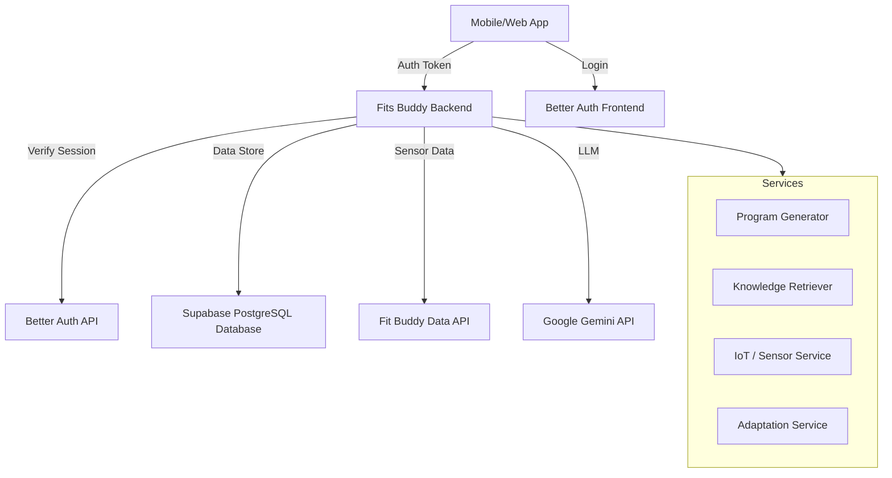
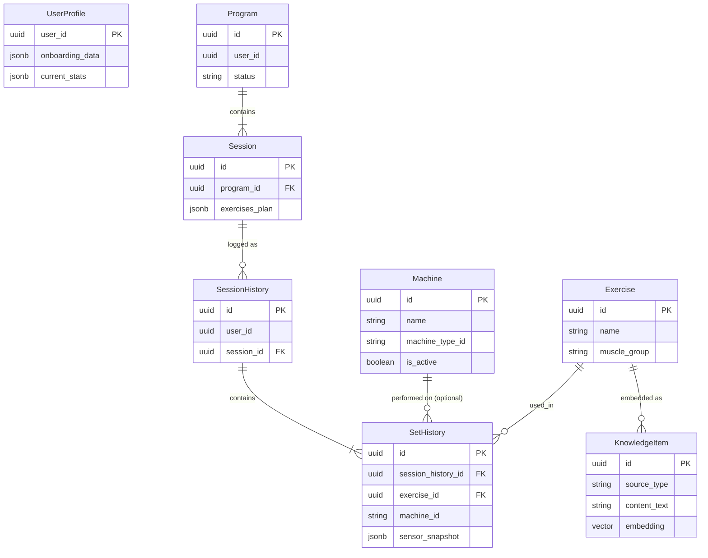
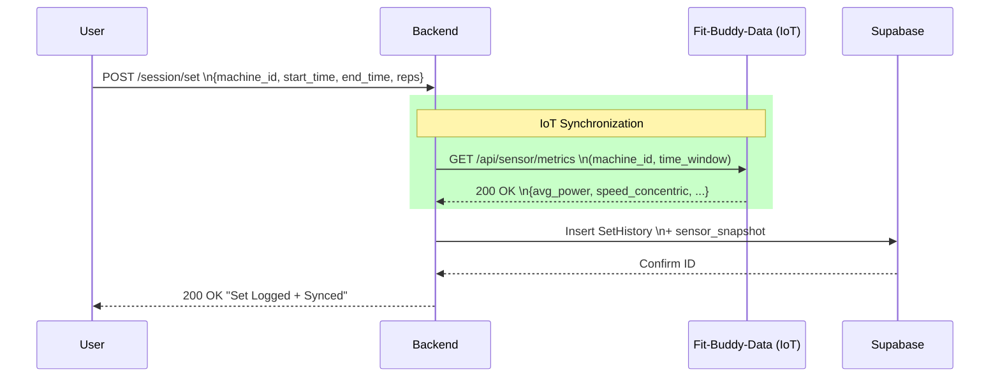
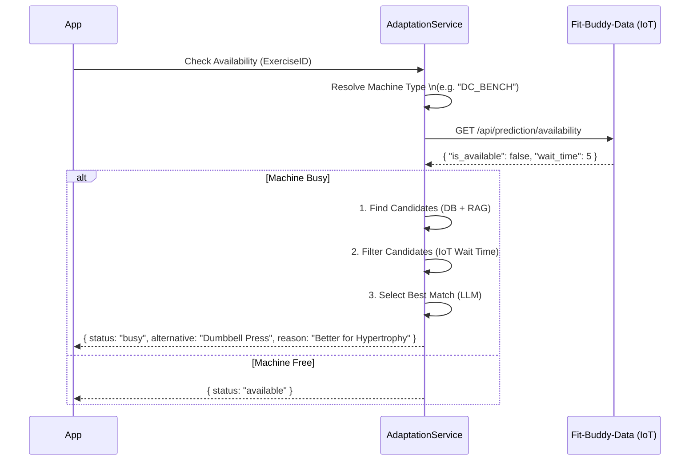

# Fits Buddy Backend

The core application server for the Fits Buddy ecosystem.
This service handles User Profiles, Workout Generation (AI/RAG), Session Tracking, and integration with physical gym sensors.

## 1. Global Architecture

The backend operates as the central brain, while authentication is delegated to the Frontend (Better Auth).



### External Services
- **Better Auth (Frontend)**: Handles User Authentication and Session Management. The backend validates tokens by calling the Better Auth API.
- **Supabase PostgreSQL**: Acts as the primary relational database (`pgvector` enabled for RAG). It does *not* handle Auth in this architecture.
- **Fit Buddy Data API** (`:8001`): A microservice that mocks physical gym machines. It provides real-time availability predictions and detailed sensor metrics (speed, power) for logged sets.
- **Gemini API**: The LLM engine used for generating workout narratives and structuring "Smart" programs.

---

## 2. API Architecture & Routes

The API is versioned (currently `v1`) and organized by domain.

### Profile `(endpoints/profile.py)`
| Method | Endpoint | Description |
|--------|----------|-------------|
| `GET` | `/api/v1/profile/me` | Fetch user profile & stats. Requires valid Better Auth Session. |

### Workout Programs `(endpoints/program.py)`
| Method | Endpoint | Description |
|--------|----------|-------------|
| `POST` | `/generate` | **Core Feature**. Generates a workout program. Accepts `method='template'` or `'smart'`. |
| `GET` | `/current` | Retrieve the active program plan. |

### Session Tracking `(endpoints/session.py)`
| Method | Endpoint | Description |
|--------|----------|-------------|
| `POST` | `/session/start` | Initialize a session log. |
| `GET` | `/session/check-availability/{id}`| call IoT Service to check if machine is free. |
| `POST` | `/session/set` | **Log a Set**. Automatically calls **Sensor API** to sync speed/power data if a specific machine is used. |
| `POST` | `/session/stop` | Finalize session, calculate XP and duration. |

To see the full API documentation, visit `http://localhost:8000/docs` (when running locally of course).

---

## 3. Program Generation Logic

We support two distinct strategies for creating workouts, controlled by the `method` parameter.

### A. Template Mode (`method="template"`)
*The "Classic" Approach.*
1.  **Selection**: Based on user Goal/Level, a static template is selected (e.g., "Full Body Beginner").
2.  **Enrichment**: An LLM call generates a motivational narrative and description for the program.
3.  **Fast & Reliable**: Best for users who want standard, proven routines.

### B. Smart RAG Mode (`method="smart"`)
*The "AI Personalized" Approach using the **Architect & Librarian** pattern.*

1.  **The Architect (LLM)**:
    *   Analyzes User Profile (Injuries, Equipment, Goals).
    *   Generates a "Skeleton" of the workout.
    *   *Crucially*, it does not pick specific DB IDs. It invents **Semantic Search Queries** (e.g., "Compound Leg Exercise Quad Focus").
2.  **The Librarian (RAG)**:
    *   Takes the Semantic Queries from the Architect.
    *   Performs a Vector Search (`pgvector`) against the `knowledge_items` database (embedded exercises).
    *   Finds the **Real Database Entity** (Exercise ID) that best matches the description.
3.  **Realization**:
    *   The Skeleton is hydrated with real Exercise IDs.
    *   The result is a fully executable program linked to our database.

---

## 4. Database Model

The database is PostgreSQL (via Supabase) with `pgvector` extension.



## 5. Key System Workflows

### 5.1 Session Tracking
Detailed flow of how the backend syncs with the IoT Sensor Service when a user logs a set in the gym.

1.  **User Input**: The user finishes a set and sends `reps`, `weight`, and the machine's `QR Code ID`.
2.  **Time Window**: The backend calculates the exact start/end time of the set.
3.  **Sensor Sync**: It calls the `fit-buddy-data` API to fetch the "Golden Record" (Power, Speed) for that specific machine and time window.
4.  **Merge & Save**: The sensor data is merged with the user log and saved in `SetHistory`.



### 5.2 Smart Adaptation Service (Availability Check)
*(Located in `app/services/adaptation.py`)*

When a user checks if a machine is free, the backend runs a **Hybrid Search (RAG + IoT + LLM)** to find valid alternatives.

1.  **Broad Search**: Finds candidates via DB (hardcoded) and RAG (semantic similarity).
2.  **IoT Filtering**: Checks `fit-buddy-data` for real-time availability.
3.  **LLM Selection**: Gemini picks the best available option for the user's goal.



### Core Entities
*   **`UserProfile`**: Stores onboarding data (JSONB) and physical stats.
*   **`Program`**: A planned routine (Name, Goal, Dates). Contains multiple `Sessions`.
*   **`Session`**: A planned workout day. Contains a JSON `exercises_plan`.
*   **`Exercise`**: The dictionary of available movements. linked to `Machine`.

### History Logging
*   **`SessionHistory`**: An actual instance of a user performing a session.
*   **`SetHistory`**: The granular log of a set.
    *   **`sensor_snapshot` (JSONB)**: The "Golden Record" from the IoT sensors (Speed, Reps) stored immutably.
    *   **`machine_id`**: The specific hardware ID (QR Code) used.

### RAG / Knowledge
*   **`KnowledgeItem`**: Represents text chunks or exercises.
    *   `embedding`: Vector(768) column for semantic search.
    *   `source_type`: 'exercise' or 'doc_chunk'.

---

## 6. Installation & Local Development

This project uses `uv` for ultra-fast python package management.

### Prerequisites
*   Python 3.11+
*   `uv` installed (`pip install uv`)
*   Supabase URL/Key in `.env`
*   Gemini API Key in `.env`
*   Better Auth URL/Secret in `.env`

### Run Locally

1.  **Install Dependencies**
    ```bash
    uv sync
    ```

2.  **Start Development Server**
    ```bash
    uv run dev
    ```
    The API will be available at `http://localhost:8000`.
    Swagger Docs: `http://localhost:8000/docs`

3.  **Run Tests**
    ```bash
    uv run pytest
    ```