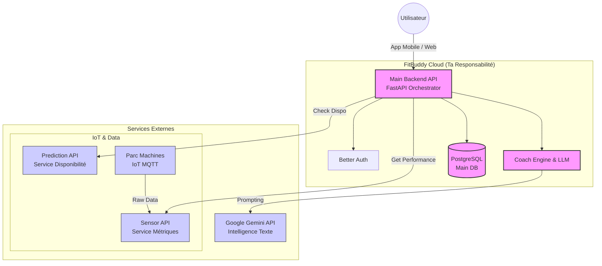
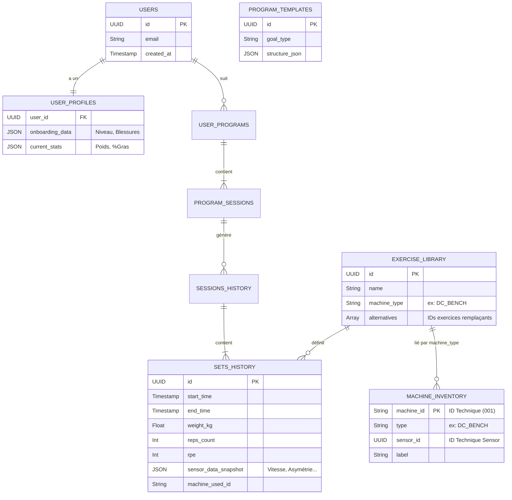
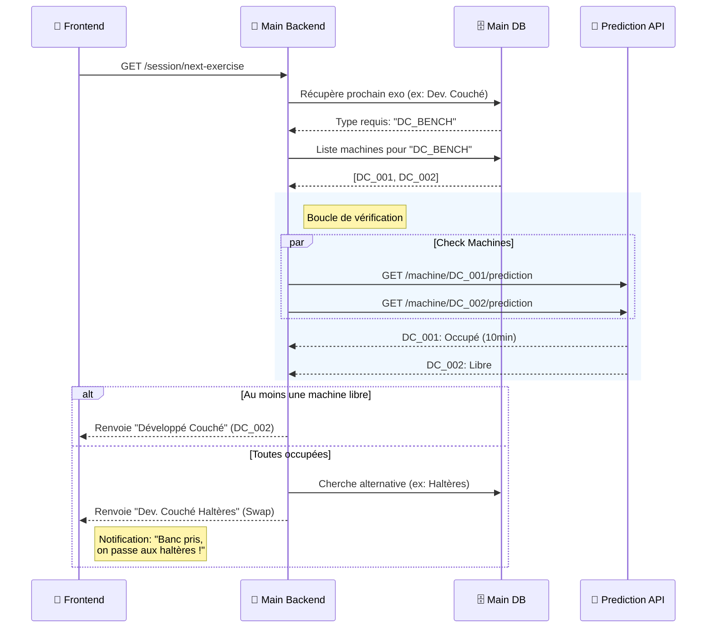
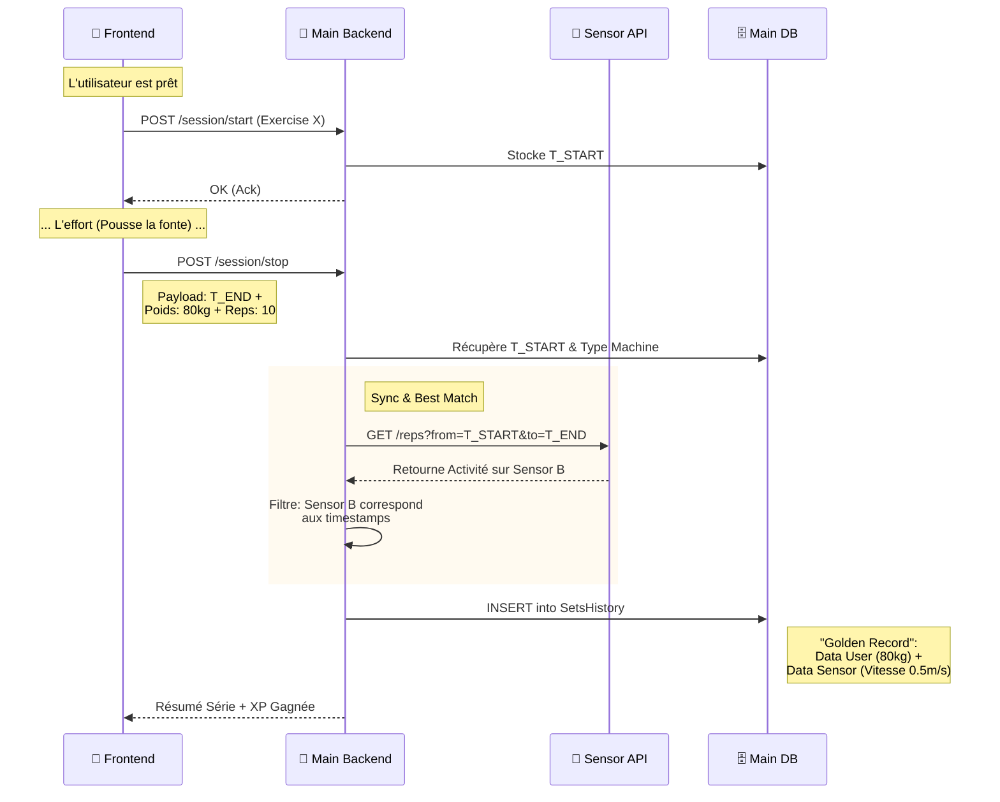

### 1. Architecture Globale

---

### 2. Modèle de Données (ERD)

Ce schéma détaille la structure de la base de données PostgreSQL, mettant en évidence le lien "mou" (Logical Mapping) entre les exercices et le hardware.

---

### 3. Séquence : Smart Routing (Avant l'effort)

Le flux où le backend vérifie la disponibilité d'un *groupe* de machines avant de servir l'exercice.

---

### 4. Séquence : Precision Tracking (Pendant l'effort)

Le flux "Chrono Maître" qui permet de synchroniser l'action humaine avec les données capteurs.

