### 1. Architecture Globale

```mermaid
graph TD
    %% Clients
    User((Utilisateur)) -->|App Mobile / Web| Gateway[Main Backend API<br/>FastAPI Orchestrator]

    %% Main Backend
    subgraph "FitBuddy Cloud (Ta Responsabilité)"
        Gateway
        Auth[Better Auth]
        LLM_Engine[Coach Engine & LLM]
        DB[(PostgreSQL<br/>Main DB)]
        
        Gateway --> Auth
        Gateway --> LLM_Engine
        Gateway --> DB
    end

    %% External Services
    subgraph "Services Externes"
        Gemini[Google Gemini API<br/>Intelligence Texte]
        
        subgraph "IoT & Data"
            PredictionAPI[Prediction API<br/>Service Disponibilité]
            SensorAPI[Sensor API<br/>Service Métriques]
            Machines[Parc Machines<br/>IoT MQTT]
        end
    end

    %% Flux
    LLM_Engine -->|Prompting| Gemini
    Gateway -->|Check Dispo| PredictionAPI
    Gateway -->|Get Performance| SensorAPI
    Machines -->|Raw Data| SensorAPI

    classDef main fill:#f9f,stroke:#333,stroke-width:2px;
    classDef ext fill:#ccf,stroke:#333,stroke-width:1px;
    class Gateway,DB,LLM_Engine main;
    class Gemini,PredictionAPI,SensorAPI,Machines ext;

```

---

### 2. Modèle de Données (ERD)

Ce schéma détaille la structure de la base de données PostgreSQL, mettant en évidence le lien "mou" (Logical Mapping) entre les exercices et le hardware.

```mermaid
erDiagram
    USERS ||--|| USER_PROFILES : "a un"
    USERS ||--o{ USER_PROGRAMS : "suit"
    USER_PROGRAMS ||--|{ PROGRAM_SESSIONS : "contient"
    
    PROGRAM_SESSIONS ||--o{ SESSIONS_HISTORY : "génère"
    SESSIONS_HISTORY ||--|{ SETS_HISTORY : "contient"
    
    %% Référentiel
    EXERCISE_LIBRARY ||--o{ MACHINE_INVENTORY : "lié par machine_type"
    EXERCISE_LIBRARY ||--o{ SETS_HISTORY : "définit"
    
    %% Tables Détails
    USERS {
        UUID id PK
        String email
        Timestamp created_at
    }

    USER_PROFILES {
        UUID user_id FK
        JSON onboarding_data "Niveau, Blessures"
        JSON current_stats "Poids, %Gras"
    }

    PROGRAM_TEMPLATES {
        UUID id PK
        String goal_type
        JSON structure_json
    }

    EXERCISE_LIBRARY {
        UUID id PK
        String name
        String machine_type "ex: DC_BENCH"
        Array alternatives "IDs exercices remplaçants"
    }

    MACHINE_INVENTORY {
        String machine_id PK "ID Technique (001)"
        String type "ex: DC_BENCH"
        UUID sensor_id "ID Technique Sensor"
        String label
    }

    SETS_HISTORY {
        UUID id PK
        Timestamp start_time
        Timestamp end_time
        Float weight_kg
        Int reps_count
        Int rpe
        JSON sensor_data_snapshot "Vitesse, Asymétrie..."
        String machine_used_id
    }

```

---

### 3. Séquence : Smart Routing (Avant l'effort)

Le flux où le backend vérifie la disponibilité d'un *groupe* de machines avant de servir l'exercice.

```mermaid
sequenceDiagram
    participant User as 📱 Frontend
    participant Back as 🧠 Main Backend
    participant DB as 🗄️ Main DB
    participant Pred as 🔮 Prediction API

    User->>Back: GET /session/next-exercise
    
    Back->>DB: Récupère prochain exo (ex: Dev. Couché)
    DB-->>Back: Type requis: "DC_BENCH"
    
    Back->>DB: Liste machines pour "DC_BENCH"
    DB-->>Back: [DC_001, DC_002]
    
    rect rgb(240, 248, 255)
        note right of Back: Boucle de vérification
        par Check Machines
            Back->>Pred: GET /machine/DC_001/prediction
            Back->>Pred: GET /machine/DC_002/prediction
        end
        Pred-->>Back: DC_001: Occupé (10min)
        Pred-->>Back: DC_002: Libre
    end

    alt Au moins une machine libre
        Back-->>User: Renvoie "Développé Couché" (DC_002)
    else Toutes occupées
        Back->>DB: Cherche alternative (ex: Haltères)
        Back-->>User: Renvoie "Dev. Couché Haltères" (Swap)
        note right of User: Notification: "Banc pris,<br/>on passe aux haltères !"
    end

```

---

### 4. Séquence : Precision Tracking (Pendant l'effort)

Le flux "Chrono Maître" qui permet de synchroniser l'action humaine avec les données capteurs.

```mermaid
sequenceDiagram
    participant User as 📱 Frontend
    participant Back as 🧠 Main Backend
    participant Sensor as 📡 Sensor API
    participant DB as 🗄️ Main DB

    Note over User: L'utilisateur est prêt
    User->>Back: POST /session/start (Exercise X)
    Back->>DB: Stocke T_START
    Back-->>User: OK (Ack)

    Note over User: ... L'effort (Pousse la fonte) ...

    User->>Back: POST /session/stop
    Note right of User: Payload: T_END +<br/>Poids: 80kg + Reps: 10
    
    Back->>DB: Récupère T_START & Type Machine

    rect rgb(255, 250, 240)
        note right of Back: Sync & Best Match
        Back->>Sensor: GET /reps?from=T_START&to=T_END
        Sensor-->>Back: Retourne Activité sur Sensor B
        Back->>Back: Filtre: Sensor B correspond<br/>aux timestamps
    end

    Back->>DB: INSERT into SetsHistory
    note right of DB: "Golden Record":<br/>Data User (80kg) +<br/>Data Sensor (Vitesse 0.5m/s)

    Back-->>User: Résumé Série + XP Gagnée

```

